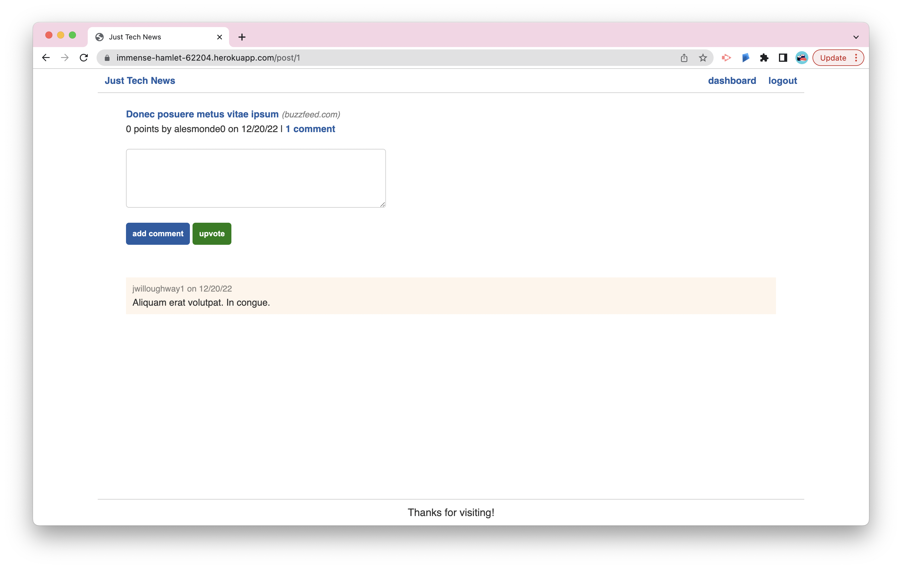

# Python News Feed 🗞

## Description

A tech-news website where users can post, upvote, and comment on links to news articles. The app has authentication so that logged-in users can update and delete their posts through a special dashboard interface. The application was refactored from an application that was originally built using Node.js to an application that uses Python and Flask.

## Technologies Used:

- Python 3
- Flask
- MySQL
- SQL Alchemy
- Jinja2
- Bcrypt

   

## Table of Contents

- [Deployed Link](#deployed-link)
- [License](#license)
- [Questions](#questions)

   

## Deployed Link

 
[Python News Feed Application](https://immense-hamlet-62204.herokuapp.com/)
 

## License

This project is licensed under the [MIT License](https://choosealicense.com/licenses/mit/).  
  

## Questions

[GitHub](https://github.com/dneflas)
